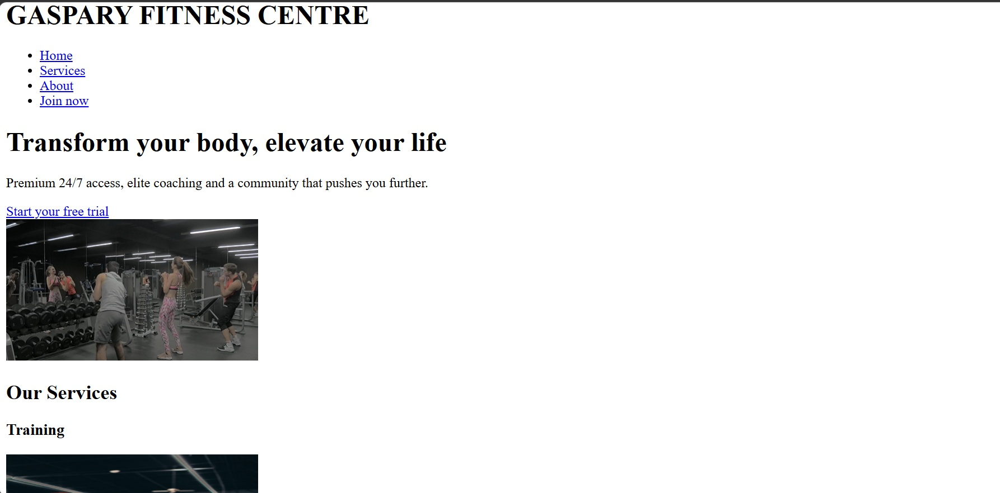

Gaspary Fitness Centre
---
1. Project Brief

Gaspary Fitness Centre project is a modern and responsive landing page designed for a high- end fitness facility.

2. Business Rationale

In a competitive fitness market, a strong digital presence is essential. Gaspary Fitness centre addresses two key business needs:

- Brand Authority: A professional design establishes trust and positions the fitness centre as the premium provider.
- Information accessibility: The site ensures busy users can find training classes information and location on any device.

3. Technologi-es used

- HTML5: Semantic structure for SEO and accessibility.
- Git/Github: Version: version control and feature-based branching.

**4. Accessibility features**

- Semantic HTML: Using header, main, section, article tags for screen readers
- Responsive images: Ensuring all images have descriptive alt tags
- Responsive images: Ensuring all images have descriptive alt tags.

**5. Embeded media**
The project includes the following media assets to engage user engagement:
* 'fitness.jpg': Visual representation of fitness services.
- 'poster.jpg': High quality hero image.

- 'fitness.mp4': Backgound promotional video.

**6. Git workflow**

This project followed professional branching strategy:

* main: Production ready code.

* develop: Main integration branch.

* feature/ branches: Created for specific tasks like feature/contact-form.

**7. Set up instructions**

a. Clone this repository on your local machine.

b. Ensure you have the media files.

c. Open 'index.html' in any browser.

**8. Screenshots**

